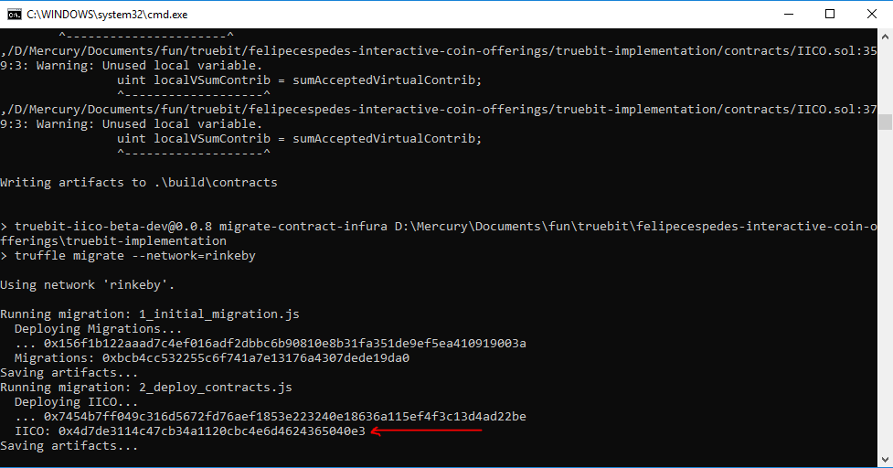

# truebit-iico-beta-dev

## How to deploy the contract into the infura-rinkeby network

- Clone this repository
- Open the `truebit-implementation` folder
- Install the dependencies using `npm install`
- Add the required variables to to the `.env` file:

**MNEMONIC** is the mnemonic of your wallet, if you are using metamask you can get this under **Setting > Reveal Seed Words**

**INFURA_API_KEY** is the API KEY provided by infura

- Deploy the contract using `npm run deploy-contract-infura`
- You will see the deployed contact address on the console


**Notes:** 
- Rember to whitelist the contract address in the infura dashboard in order to use it
- Please do not commit/push changes in the `.env` file to this repository

### Changelog

- **Breaking Changes:** starting in version `1.0.0` you should import the `IICO` and `IICOABI` like:

```js
import { IICO, IICOABI } from 'truebit-iico-beta-dev';
```

- **Breaking Changes:** starting in version `2.0.0` you can only import the `IICOABI`
